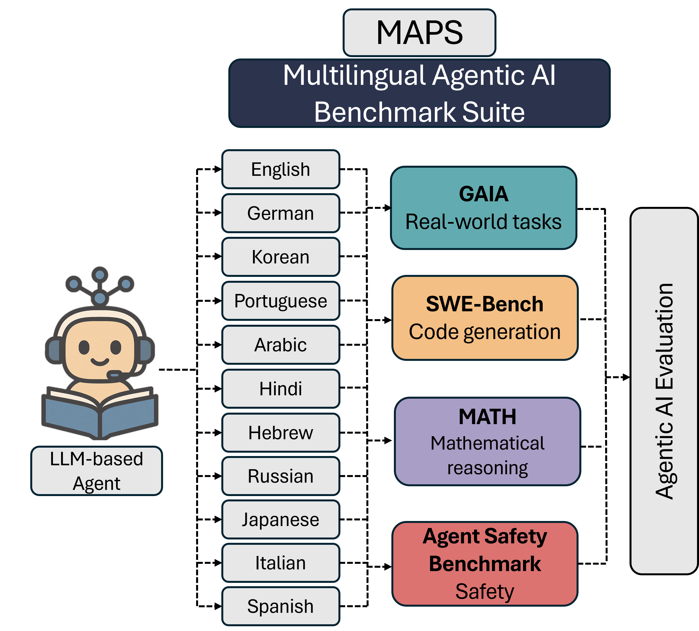
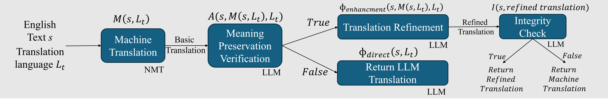

# MAPS Demo: Hybrid Translation System for Multilingual Agentic Benchmarks

This repository provides a reference implementation of the **hybrid translation pipeline** used in the MAPS benchmark, introduced in our paper:  
**MAPS: A Multilingual Agent Performance and Safety Benchmark**

## 🖼️ Benchmark Overview

**Figure 1:** MAPS benchmark structure across agents, tasks, and 11 languages  


## 🔄 Hybrid Translation Pipeline

To create high-fidelity multilingual agentic benchmarks, we designed a **multi-stage translation system** that balances structural alignment, semantic accuracy, and task-specific fidelity.  
This pipeline was critical to generating consistent and verifiable task variants across 10 target languages beyond English.



## Key Features

- **Hybrid Translation Pipeline**: Combines the speed of machine translation with the quality of LLM-based refinement
- **Math Expression Preservation**: Preserves LaTeX and other mathematical expressions during translation
- **Multi-step QA Process**: Employs a 3-step quality assurance and correction pipeline for accurate translations
- **Language Verification**: Ensures translations are correctly rendered in the target language
- **Support for Multiple Translators**: Compatible with DeepL, Google Translate, and LLM-based translation

## Installation

```bash
# Clone the repository
git clone https://github.com/yourusername/hybrid-translation-demo.git
cd hybrid-translation-demo

# Create a virtual environment (recommended)
python -m venv venv
source venv/bin/activate  # On Windows: venv\Scripts\activate

# Install dependencies
pip install -r requirements.txt
```

## Configuration

Before running the demo, you need to configure your API keys:

1. Create a `.env` file in the project root directory
2. Add your API keys to the file:

```
# LLM API (Azure OpenAI, OpenAI, etc.)
AZURE_OPENAI_API_KEY=your_azure_openai_key
# Or for regular OpenAI
OPENAI_API_KEY=your_openai_key

# Google Cloud API (optional)
GOOGLE_APPLICATION_CREDENTIALS=path/to/your/google_credentials.json

# DeepL API (optional)
DEEPL_API_KEY=your_deepl_key
```

## Usage

The demo supports multiple translation modes:

```bash
# Basic usage
python translate_demo.py --text "Your text here" --language "Japanese" --mode "hybrid"

# Translate from file
python translate_demo.py --file input.txt --language "Spanish" --mode "llm"

# Interactive mode
python translate_demo.py --interactive
```

### Mode Options:
- `hybrid`: Uses machine translation + LLM refinement (default)
- `llm`: Uses only LLM-based translation
- `google`: Uses only Google Translate
- `deepl`: Uses only DeepL

### Supported Languages:
The system supports numerous languages including but not limited to:
- Japanese
- Russian
- Hebrew
- Spanish
- Chinese
- French
- German
- Korean
- Italian
- Arabic
- and many more

## Prompt Customization

Custom translation prompts can be modified in the `prompts` directory. For each dataset type (math, general text, etc.), there are specific prompts that control the translation process.

### Prompt Structure:
```
prompts/
├── math/
│   └── llm.json
│   └── hybrid.json
├── gaia/
│   └── llm.json
│   └── hybrid.json
└── ...
```

## Project Structure

```
hybrid-translation-demo/
├── translate_demo.py        # Main demo CLI
├── requirements.txt         # Dependencies
├── .env                     # API keys (not in repository)
├── prompts/                 # Translation prompts
├── utils/
│   ├── logger.py            # Logging utilities
│   ├── math_preserver.py    # Math expression preservation
│   └── prompts_manager.py   # Manages system prompts
└── translator/
    ├── base_translator.py   # Abstract base class
    ├── llm_translator.py    # LLM-based translator
    ├── google_translator.py # Google Translate wrapper
    ├── deepl_translator.py  # DeepL API wrapper
    └── hybrid_translator.py # Combined approach
```

```

## License

[MIT License](LICENSE)
